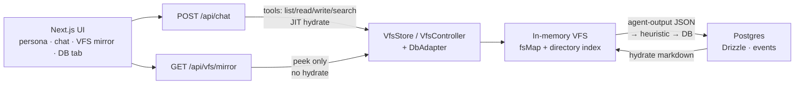

# VFS Marketplace Agent

A demo app that gives an AI agent a **virtual file system (VFS)** as its working surface for a small marketplace domain (sellers, customers, support).

You pick a persona (and ticket for support), explore a live file tree, and chat with a multi-provider agent. The agent uses VFS tools to read markdown projections of DB records and write structured JSON under `marketplace/agent-output/` — heuristic code then updates Postgres, appends an `events` row, and refreshes the matching domain `.md` files.

Runtime agent rules: [`AGENTS.md`](./AGENTS.md) and [`lib/agent/system-instructions.md`](./lib/agent/system-instructions.md).

---

## The problem

Most agent demos either:

- dump huge blobs of JSON into the prompt, or
- expose open-ended “call the API / run SQL” tools that are hard to reason about and easy to misuse.

For a multi-actor marketplace you also need **scoped visibility** (a customer must not see another customer’s tree) and a clear story for **what the agent is allowed to change**.

The question this project explores:

> Can an agent work more reliably if marketplace state looks like a **small, lazy file tree** — with closed path shapes, explicit read/write surfaces, and the database remaining the source of truth?

---

## Direction taken

| Choice | Why |
| --- | --- |
| **DB = source of truth**; VFS = transient projection | Avoid dual-write drift; VFS can be reset per session |
| **Lazy / JIT hydration** by persona (+ ticket for support) | Don’t load the whole marketplace into memory or the prompt |
| **Agent reads `.md`**, **writes `.json` under `agent-output/`** | Readable context for the model; machine-checkable mutations (Zod) |
| **Heuristic mapper** (not free-form SQL) | Rule-based JSON → domain tables + `events` row |
| **Event log pattern** | Append-only `events` rows recorded **alongside** each domain DB update (audit trail — not event-sourced replay) |
| **Closed path allowlists + digit UUID ids** | Reject invented paths before any DB work |
| **One agent** (no subagents) | Keep the demo focused on VFS-as-tool, not orchestration |
| **Persona picker, no real auth** | Fast demo loop; permissions in instructions + runtime checks |
| **Australia/Sydney for processing**; browser TZ for UI | Stable server-side formatting; local-friendly UI |
| **UI mirror ≠ agent hydrate** | VFS tab polls an in-memory snapshot; agent tools JIT-hydrate the same session store |

Domain state is **read as markdown** and **written as JSON** under `marketplace/agent-output/`; domain `.md` files stay read-only for now.

---

## Architecture



**Stack:** Next.js (App Router) · TypeScript · Drizzle · Postgres · AI SDK (`ai` + OpenAI / Gemini / Anthropic) · `@ai-sdk/react` · Zod · PostHog · shadcn/ui · headless-tree · Biome

**Domain actors:** `CUSTOMER` · `SELLER` · `SUPPORT`

### VFS layout (no leading slash)

```txt
marketplace/
  agent-output/output-N.json     # agent writes (create-only, then read-only)
  sellers/{id}/profile.md
  sellers/{id}/products/{id}.md
  customers/{id}/profile.md
  customers/{id}/orders/{id}.md
  customers/{id}/support/{id}.md
```

Path patterns are closed allowlists in [`lib/vfs/types.ts`](./lib/vfs/types.ts) (`VFS_DIRECTORY_PATHS`, `VFS_DOMAIN_FILE_PATHS`, `VFS_AGENT_OUTPUT_FILE_PATHS`), gated at runtime by [`lib/vfs/paths.ts`](./lib/vfs/paths.ts).

### Agent tools

| Tool | Behavior |
| --- | --- |
| `list_directory` | Flat list of immediate children; JIT hydrate |
| `read` | Read domain `.md` or agent-output JSON |
| `write` | Create-only `marketplace/agent-output/output-N.json` → Zod → DB + `events` → refresh `.md` |
| `search` | Case-insensitive contains under an allowed directory |

No `modify`, rename, overwrite, or append.

Agent tools and the VFS mirror share one in-memory controller per session key (`role:personaId:ticketId`).

### Chat flow

1. Complete session (`role` + `personaId`; `SUPPORT` also needs `ticketId`) and a provider API key (browser `localStorage`).
2. `ChatPanel` streams via `useChat` → `POST /api/chat` with UI messages, provider, apiKey, and `session` object.
3. Route gates session, runs user guardrails, builds system prompt (instructions + injected session), resolves the fixed model for the provider, runs `streamText` with VFS tools, and emits PostHog lifecycle events.
4. On finish, the Database tab refetches; the VFS mirror keeps polling (~1.5s).

### Providers / models

| Provider | Model |
| --- | --- |
| OpenAI | `gpt-5.6-luna` |
| Gemini | `gemini-2.5-pro` |
| Anthropic | `claude-opus-4-20250514` |

Shared in [`lib/types.ts`](./lib/types.ts) (`PROVIDER_MODELS`).

### Writes implemented today

- **Customer profile edit** via agent-output JSON (`name` / `email_id` for the active customer only).
- Other intents (orders, tickets, products, seller edits, ticket messages) are **placeholders** — do not invent schemas.

### Key code

| Area | Location |
| --- | --- |
| Agent rules | [`AGENTS.md`](./AGENTS.md), [`lib/agent/system-instructions.md`](./lib/agent/system-instructions.md) |
| Chat route | [`app/api/chat/route.ts`](./app/api/chat/route.ts) |
| Tools / guardrails / providers | [`lib/agent/`](./lib/agent/) |
| VFS runtime | [`lib/vfs/`](./lib/vfs/) |
| VFS mirror API | [`app/api/vfs/mirror/route.ts`](./app/api/vfs/mirror/route.ts) |
| DB schema | [`lib/db/schema.ts`](./lib/db/schema.ts) |
| PostHog | [`lib/analytics/posthog.ts`](./lib/analytics/posthog.ts) |

---

## Current status

**Working**

- Persona / ticket picker
- Lazy VFS hydration for agent tools; UI mirror of the in-memory tree (no click-to-hydrate)
- Domain DB → markdown (frontmatter, status definitions, Sydney message times)
- Streaming multi-provider chat with `list_directory` / `read` / `write` / `search`
- User + path guardrails; PostHog start/end, tokens, tool calls, errors
- Customer profile edit end-to-end (JSON → DB + events → `.md` + mirror / DB tab)

**Still out of scope / later**

- Remaining write Zod schemas (orders, tickets, products, …)
- Subagents, `modify` / overwrite / rename
- Real auth

---

## Run locally

### Prerequisites

- Node.js 20+ (recommended)
- A Postgres database (e.g. [Supabase](https://supabase.com) project — Postgres only)
- An API key for at least one chat provider (OpenAI, Gemini, or Anthropic)

### 1. Install

```bash
git clone <your-repo-url> vfs-marketplace-agent
cd vfs-marketplace-agent
npm install
```

### 2. Environment

```bash
cp .env.example .env
```

```env
DATABASE_URL=postgresql://...
DATABASE_SCHEMA=project_vfs_marketplace   # optional; code has a default

# Optional analytics (chat lifecycle). Leave blank to disable.
POSTHOG_KEY=
POSTHOG_HOST=
POSTHOG_TRACING_HEADER=                   # JSON map, "Header: value", or header name
```

Provider API keys are **not** in `.env` — enter them in the UI (stored in browser `localStorage` and sent with each chat request).

### 3. Migrate & seed

```bash
npm run db:migrate
npm run seed
```

If you change the Drizzle schema:

```bash
npm run db:generate
npm run db:migrate
```

### 4. Dev server

```bash
npm run dev
```

Open [http://localhost:3000](http://localhost:3000).

1. Choose a provider and paste an API key.
2. Choose a role (`CUSTOMER` / `SELLER` / `SUPPORT`) and persona (plus ticket for support).
3. Chat with the agent — it will list/read/search the VFS and may write `output-N.json` for allowed mutations.
4. Use the **VFS** tab to watch the in-memory tree (mirror of what the agent has loaded).
5. Use the **Database** tab to inspect tables (refreshes after chat turns).

### Useful scripts

| Script | Purpose |
| --- | --- |
| `npm run dev` | Next.js dev server (Turbopack) |
| `npm run build` / `npm start` | Production build & serve |
| `npm run seed` | Reseed marketplace demo data |
| `npm run db:generate` | Generate Drizzle migrations |
| `npm run db:migrate` | Apply migrations |
| `npm run check` | Biome check (lint + format write) |

---

## License

Private demo project — adjust as needed if you publish it.
