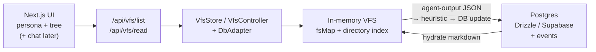

# VFS Marketplace Agent

A demo app that gives an AI agent a **virtual file system (VFS)** as its working surface for a small marketplace domain (sellers, customers, support).

You pick a persona, explore a live file tree, and (as chat tools come online) the agent reads markdown projections of DB records and writes structured JSON under `marketplace/agent-output/` — heuristic code then updates Postgres and refreshes the VFS.

---

## The problem

Most agent demos either:

- dump huge blobs of JSON into the prompt, or
- expose open-ended “call the API / run SQL” tools that are hard to reason about and easy to misuse.

For a multi-actor marketplace you also need **scoped visibility** (a customer must not see another customer’s tree) and a clear story for **what the agent is allowed to change**.

The question this project explores:

> Can an agent work more reliably if marketplace state looks like a **small, lazy file tree** — with closed path shapes, explicit read/write surfaces, and the database remaining the source of truth?

---

## Direction taken

| Choice                                                          | Why                                                                                                             |
| --------------------------------------------------------------- | --------------------------------------------------------------------------------------------------------------- |
| **DB = source of truth**; VFS = transient projection            | Avoid dual-write drift; VFS can be reset per session                                                            |
| **Lazy / JIT hydration** by persona (+ ticket for support)      | Don’t load the whole marketplace into memory or the prompt                                                      |
| **Agent reads `.md`**, **writes `.json` under `agent-output/`** | Readable context for the model; machine-checkable mutations (Zod)                                               |
| **Heuristic mapper** (not free-form SQL)                        | Rule-based JSON → domain tables + `events` row                                                                  |
| **Event log pattern**                                           | Append-only `events` rows recorded **alongside** each domain DB update (audit trail — not event-sourced replay) |
| **Closed path allowlists + digit UUID regex**                   | Reject invented paths before any DB work                                                                        |
| **One agent** (no subagents)                                    | Keep the demo focused on VFS-as-tool, not orchestration                                                         |
| **Persona picker, no real auth**                                | Fast demo loop; permissions encoded in instructions + runtime checks                                            |
| **Australia/Sydney for processing**; browser TZ for UI display  | Stable server-side formatting; local-friendly UI                                                                |

Domain state is **read as markdown** and **written as JSON** under `marketplace/agent-output/`; domain `.md` files stay read-only for now.

---

## Architecture



**Stack:** Next.js (App Router) · TypeScript · Drizzle · Postgres · shadcn/ui · headless-tree · Zod · (AI SDK ready for chat tools)

**Domain actors:** `CUSTOMER` · `SELLER` · `SUPPORT`

**VFS layout (no leading slash):**

```txt
marketplace/
  agent-output/output-N.json     # agent writes (create-only, then read-only)
  sellers/{id}/profile.md
  sellers/{id}/products/{id}.md
  customers/{id}/profile.md
  customers/{id}/orders/{id}.md
  customers/{id}/support/{id}.md
```

Key code:

| Area        | Location                                                                 |
| ----------- | ------------------------------------------------------------------------ |
| Agent rules | [`lib/agent/system-instructions.md`](./lib/agent/system-instructions.md) |
| VFS runtime | [`lib/vfs/`](./lib/vfs/)                                                 |
| DB schema   | [`lib/db/schema.ts`](./lib/db/schema.ts)                                 |

---

## Current status

**Working**

- Persona / ticket picker
- Lazy VFS list + read APIs
- Live VFS tree UI (session-scoped)
- DB → markdown hydrate (frontmatter, status definitions, Sydney message times)
- Heuristic path for **customer profile edit** via agent-output JSON (callable from `VfsStore` / controller; chat tools not wired yet)

**Next**

- Wire AI SDK chat tools (`list_directory`, `read`, `write`, `search`)
- Remaining write schemas (orders, tickets, products, …)
- Guardrails + PostHog tracing on the chat route

---

## Run locally

### Prerequisites

- Node.js 20+ (recommended)
- A Postgres database (e.g. [Supabase](https://supabase.com) project — Postgres only)

### 1. Install

```bash
git clone <your-repo-url> vfs-marketplace-agent
cd vfs-marketplace-agent
npm install
```

### 2. Environment

```bash
cp .env.example .env
```

Set at least:

```env
DATABASE_URL=postgresql://...
```

Optional (defaults shown in code):

```env
DATABASE_SCHEMA=project_vfs_marketplace
```

### 3. Migrate & seed

```bash
npm run db:migrate
npm run seed
```

If you change the Drizzle schema:

```bash
npm run db:generate
npm run db:migrate
```

### 4. Dev server

```bash
npm run dev
```

Open [http://localhost:3000](http://localhost:3000).

1. Choose a role (`CUSTOMER` / `SELLER` / `SUPPORT`).
2. Pick a persona (or ticket for support).
3. Use the **VFS** tab to expand folders and open markdown files.
4. Use the **Database** tab to inspect tables (not session-scoped).

### Useful scripts

| Script                        | Purpose                        |
| ----------------------------- | ------------------------------ |
| `npm run dev`                 | Next.js dev server (Turbopack) |
| `npm run build` / `npm start` | Production build & serve       |
| `npm run seed`                | Reseed marketplace demo data   |
| `npm run db:generate`         | Generate Drizzle migrations    |
| `npm run db:migrate`          | Apply migrations               |
| `npm run lint`                | ESLint                         |

---

## License

Private demo project — adjust as needed if you publish it.
